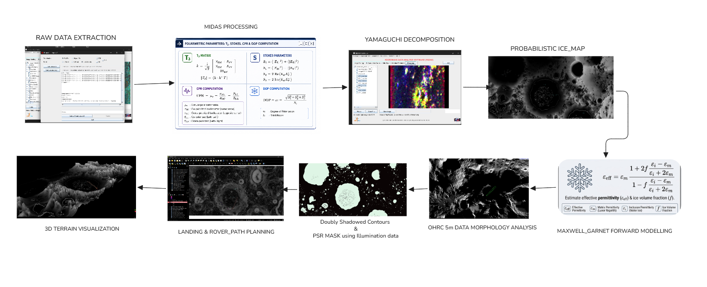
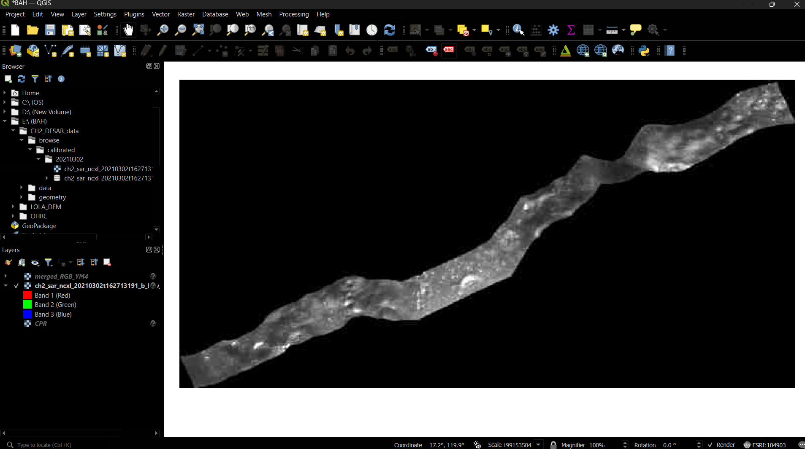
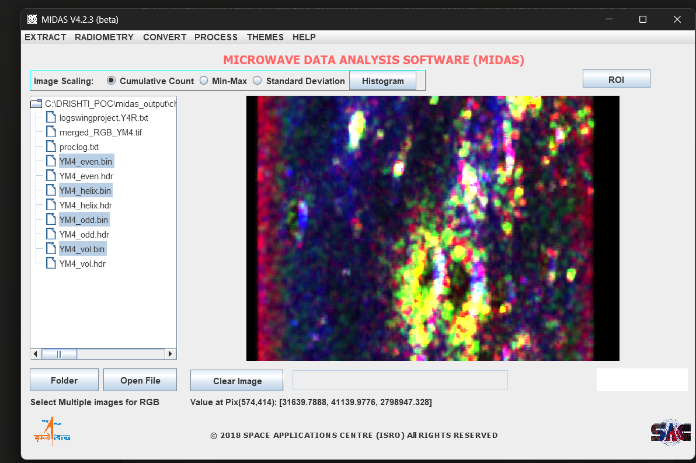
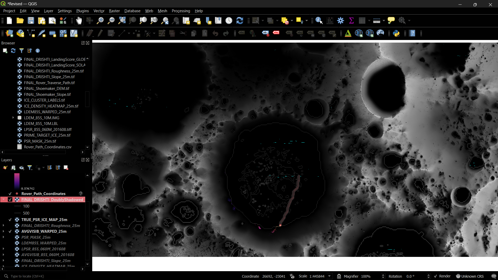
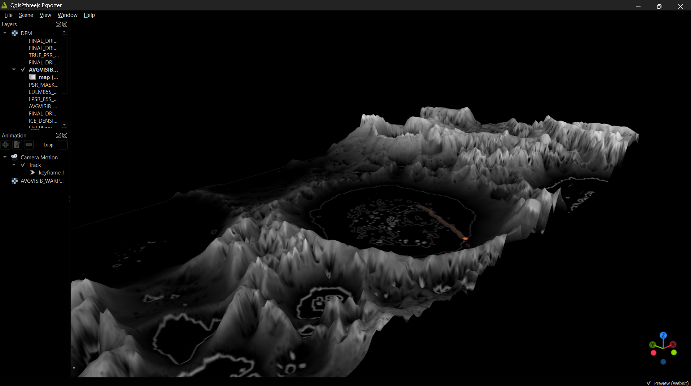

# D.R.I.S.H.T.I.
### **D**ual-Frequency **R**adar **I**nformed **S**ubsurface **H**ydration & **T**errain **I**ntelligence

*A Physics-Informed, Multi-Modal Fusion Framework for Lunar Subsurface Ice Detection and Mission Accessibility*

---

## 📌 Table of Contents
- [Overview](#-overview)
- [Problem Statement](#-problem-statement)
- [Key Features](#-key-features)
- [Physics Core & Mathematical Foundation](#-physics-core--mathematical-foundation)
- [End-to-End System Architecture](#-end-to-end-system-architecture)
- [Proof of Concept: Crater Shoemaker](#-proof-of-concept-crater-shoemaker)
- [Benchmark Results](#-benchmark-results)
- [Tech Stack](#-tech-stack)
- [Cost & Implementation Breakdown](#-cost--implementation-breakdown)
- [Team "From Light Years Away"](#-team-from-light-years-away)

---

##  Overview

**Project D.R.I.S.H.T.I** is a unified physics-constrained framework developed for the **Bharatiya Antariksh Hackathon 2026**. It integrates fully polarimetric radar scattering physics (CPR-FP, DOP, SRI), Maxwell-Garnett dielectric mixing models, kinematic geomorphology, and mobility-aware path planning.

By fusing **Chandrayaan-2 DFSAR** full-polarimetric/dual-frequency radar observations with **OHRC** high-resolution optical imagery, **LOLA GDR DEM**, and lunar illumination models, DRISHTI identifies, quantifies, and validates subsurface water-ice deposits within Permanently Shadowed Regions (PSRs) and Doubly Shadowed Regions (DSRs) while determining safe landing sites and traversable rover trajectories.

---

## 🎯 Problem Statement

> **Detection and Characterization of Subsurface Ice in Lunar South Polar Regions Using Chandrayaan-2 Radar and Imagery Data for Landing Site and Rover Traverse Planning**

Traditional radar-based detection methods often ignore spatial terrain heterogeneity and suffer from topographic ambiguity, leading to false positives caused by rocky ejecta. DRISHTI resolves these ambiguities by mathematically isolating true volumetric ice scattering from surface roughness and ejecta artifacts.

---

## ✨ Key Features

* **Multi-Modal Geospatial Intelligence:** Combines Chandrayaan-2 DFSAR radar observations with OHRC morphology, LOLA GDR DEM, and solar illumination models into a unified interpretation engine.
* **Multi-Evidence Ice Validation:** Correlates Circular Polarization Ratio (CPR-FP), Degree of Polarization (DOP), Surface Roughness Index (SRI), and shadow persistence to isolate genuine subsurface ice candidates.
* **Dielectric Ice Fraction Estimation:** Utilizes Maxwell-Garnett dielectric mixing models and Thompson lookup table inversion mapping to quantitatively estimate subsurface ice volume fraction (top 5 meters) beyond binary ice detection.
* **Accessibility-Driven Mission Analytics:** Integrates slope, roughness, boulder density, and illumination power constraints into a 2.5D Reverse Minimum Cost Path (MCP) algorithm for risk-free landing site selection and optimal rover routing.
* **Interactive Lunar Decision Workspace:** Provides an intuitive GIS-based interface for visualizing radar products, ice heatmaps, hazard layers, and trajectory routes within a single environment.

---

## Physics Core & Mathematical Foundation

> *"To distinguish true volumetric ice scattering from topographic phase noise, DRISHTI models full-polarimetric radar vector fields, dielectric mixing behavior, and surface-subsurface scattering mechanics within a unified mathematical framework."*

---

### 1. Polarimetric Vector Formulation & Coherency Matrix $[T_3]$

The polarimetric target vector $\vec{k}$ is constructed from the complex scattering matrix elements $(S_{HH}, S_{VV}, S_{HV})$ assuming target reciprocity ($S_{HV} = S_{VH}$)[cite: 1]:

$$\vec{k} = \frac{1}{\sqrt{2}} \begin{bmatrix} S_{HH} + S_{VV} \\ S_{HH} - S_{VV} \\ 2S_{HV} \end{bmatrix}$$

Applying spatially averaged multilooking and $9 \times 9$ Refined Lee speckle filtering yields the $3 \times 3$ Coherency Matrix $[T_3]$[cite: 1]:

$$[T_3] = \langle \vec{k} \cdot \vec{k}^\dagger \rangle = \begin{bmatrix} T_{11} & T_{12} & T_{13} \\ T_{21} & T_{22} & T_{23} \\ T_{31} & T_{32} & T_{33} \end{bmatrix}$$

---

### 2. Key Polarimetric Radar Metrics

#### Circular Polarization Ratio ($\text{CPR}$)
Calculates the ratio of Same-Sense ($\sigma_{LL}^\circ$) to Opposite-Sense ($\sigma_{LR}^\circ$) circular polarization backscatter to identify volumetric multiple scattering indicative of water ice[cite: 1]:

$$\text{CPR} = \frac{\sigma_{LL}^\circ}{\sigma_{LR}^\circ} = \frac{S_0 - S_3}{S_0 + S_3}$$

$$\text{CPR} \begin{cases} < 1.0 & \text{Dry Regolith / Single-bounce Surface Scattering} \\ \approx 1.0 & \text{Surface Roughness / Rocky Ejecta Blocks} \\ > 1.0 & \text{Subsurface Water Ice / Volumetric Multiple Scattering} \end{cases}$$

#### Degree of Polarization ($\text{DOP}$)
Quantifies the proportion of polarized wave energy relative to total power, isolating coherent surface reflections from depolarized subsurface scatter[cite: 1]:

$$\text{DOP} = \frac{\sqrt{S_1^2 + S_2^2 + S_3^2}}{S_0}$$

---

### 3. Maxwell-Garnett Dielectric Forward Modeling

To transform radar metrics into quantitative subsurface ice volume fraction ($f$) within the top 5 meters of lunar regolith, DRISHTI implements the Maxwell-Garnett effective medium theory for spherical ice inclusions embedded in a regolith matrix[cite: 1]:

$$\epsilon_{eff} = \epsilon_m \left[ \frac{1 + 2f \left( \frac{\epsilon_i - \epsilon_m}{\epsilon_i + 2\epsilon_m} \right)}{1 - f \left( \frac{\epsilon_i - \epsilon_m}{\epsilon_i + 2\epsilon_m} \right)} \right]$$

| Parameter | Physical Interpretation | Value / Constraint |
| :--- | :--- | :--- |
| $\epsilon_{eff}$ | Measured Effective Permittivity | $2.70 \text{ to } 3.15$[cite: 1] |
| $\epsilon_m$ | Permittivity of Dry Lunar Regolith Matrix | $\approx 2.70$[cite: 1] |
| $\epsilon_i$ | Permittivity of Pure Water Ice Inclusions | $\approx 3.15$[cite: 1] |
| $f$ | Subsurface Ice Volume Fraction | $0.0 \le f \le 1.0$[cite: 1] |

---

### 4. Multi-Criteria Disambiguation Decision Engine

To prevent false positives caused by surface roughness or steep crater rims, DRISHTI cross-evaluates radar physics against optical morphology and illumination constraints[cite: 1]:

$$
\begin{aligned}
\text{High CPR} + \text{Low DOP} &\implies \mathbf{\text{Volumetric Scattering (High-Confidence Subsurface Ice)}} \\
\text{High CPR} + \text{Slope} > 12^\circ &\implies \mathbf{\text{Dihedral Roughness / Rocky Ejecta (False Positive Rejection)}} \\
\text{PSR / DSR Mask} + \text{CPR Anomaly} &\implies \mathbf{\text{Thermally Stable Cold-Trap Ice Zone}} \\
\text{High CPR} + \text{Low SRI} &\implies \mathbf{\text{Decoupled Surface Roughness (Subsurface Ice Deposit)}}
\end{aligned}
$$

---

## 🏗️ End-to-End System Architecture

The complete processing pipeline spans data ingestion, physics analysis, multi-modal validation, and mission accessibility planning:

### Pipeline Stages:
1. **Data Inputs:** Raw DFSAR full-pol data, OHRC imagery, LOLA DEM, and solar illumination models.
2. **Physics-Based Analysis:** Extract polarimetric parameters (CPR, DOP, SRI), compute Yamaguchi YR4 4-component decomposition (Surface, Double-bounce, Volume scattering), apply Maxwell-Garnett dielectric mixing, and estimate ice fraction (top 5 m).
3. **Multi-Modal Validation:** Apply PSR/DSR shadow masking, terrain & morphologic checks, thermal stability checks, and cross-validation to remove false positives.
4. **Mission Accessibility:** Score landing site feasibility, build hazard maps, and execute Reverse Minimum Cost Path (MCP) rover trajectory planning.
5. **Outputs:** Subsurface ice heat maps, recommended landing site coordinates, traversable route vectors, and volumetric ice estimates ($m^3$).

---

## 🧪 Proof of Concept: Crater Shoemaker

The PoC was benchmarked using Chandrayaan-2 DFSAR observations over **Crater Shoemaker** across a scale of 19 Million pixels.

### Data Strip & Region of Interest (ROI) & Shadow Masking & Surface Roughness Analysis
| Data Strip | Yamaguchi Decomposition |
| :---: | :---: |
|  |  |

### Elevation & Shadowed Contours
 

### 3D Terrain & Slope Mesh 
 |

---

## 📊 Benchmark Results

| Benchmark Metric | Existing Work | **DRISHTI PoC** | Source / Notes |
| :--- | :---: | :---: | :--- |
| **$R^2$ Ordinary Least Square Coeff.** | `0.5287` | **`0.99`** | Masked 7M pixels where spatial heterogeneity dominates over inverse CPR-DOP relationship |
| **Mean Effective Permittivity ($\epsilon_{eff}$)** | `2.70` to `3.15` | **`2.947`** | Benchmark derived from Mini-RF S-band literature |
| **Volumetric Ice Estimate** | 40 to 200m thick *(S-band)* | **$2.70 \times 10^6 \text{ m}^3$** | Top 5m depth (L-band DFSAR), Uncertainty: $\pm 25\%$ |

*\*PoC benchmarked on available L-band DFSAR data over Crater Shoemaker.*

---

##  Tech Stack

* **Modeling & Processing:** Python, NumPy, SciPy, Pandas, OpenCV-Python, scikit-image, PyProj, Statsmodels, MIDAS
* **Radar & Geospatial Analysis:** QGIS, GDAL Driver, Rasterio
* **Validation & Quantification:** Maxwell-Garnett Modelling, Thompson LUT Inversion
* **Visualization & Demo:** Matplotlib, Plotly, Streamlit
* **Deployment:** FastAPI, Docker

---

**"We, as a dedicated team, are excited and humbled to solve this problem and actively contribute to India's Future Lunar Mission."**

<h2>👥 Contributors</h2>

  <a href="https://github.com/rAdvirtua">
    
     <b>Anurag</b> <small>AI/ML</small>
  </a>
  &nbsp;&nbsp;&nbsp;&nbsp;
  <a href="https://github.com/GamedAreS2176">
    
     <b>Ujaan</b> <small>FullStack</small>
  </a>
  &nbsp;&nbsp;&nbsp;&nbsp;
  <a href="https://github.com/RishavKumarMishra2006">
    
     <b>Rishav</b> <small>UI/UX</small>
  </a>

## Thanking You All

