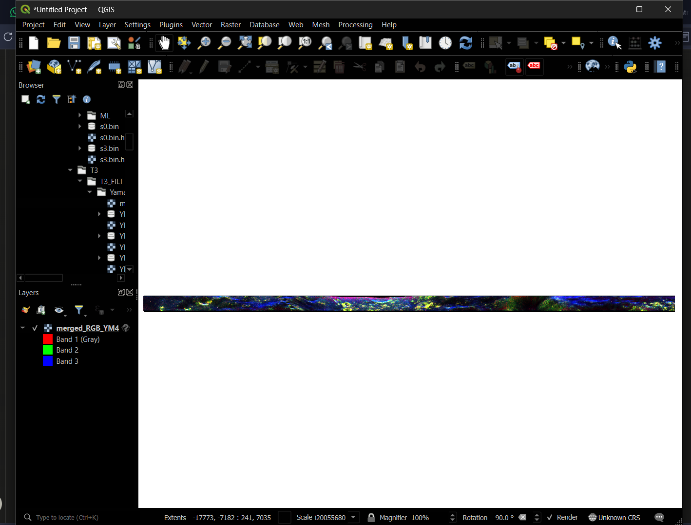

# MIDAS DFSAR Data Journey — Step by Step

## Raw DFSAR Acquisition
- Electromagnetic pulses, complex returns

## SLI TIF Files (Downloaded from PRADAN)
- Format: ComplexLSB8 — real + imaginary parts interleaved as 2‑band GeoTIFF
- Dimensions: 316,766 rows × 512 cols
- Pixel spacing: 0.52 m along‑track × 9.59 m across‑track

### Output Binary Files
- `s11_Real.bin` + `s11_Imag.bin` → S_HH(r,c) = a + bi  
- `s12_Real.bin` + `s12_Imag.bin` → S_HV(r,c) = a + bi  
- `s21_Real.bin` + `s21_Imag.bin` → S_VH(r,c) = a + bi  
- `s22_Real.bin` + `s22_Imag.bin` → S_VV(r,c) = a + bi  

**Sinclair scattering matrix:**

\[
[S] = \begin{bmatrix} S_{HH} & S_{HV} \\ S_{VH} & S_{VV} \end{bmatrix}
\]

This is the **foundation** — everything downstream derives from these 8 files.

---

## Branch A — CPR (FP) Computation

**Step 1: Convert to circular polarization basis (Stokes parameters)**  
- `stokes/s0.bin` → Total received power  
- `stokes/s3.bin` → Circular Stokes parameter  

Equation:  

\[
S3 = 2 \cdot Im(S_{HH} \cdot S_{VV}^* + S_{HV} \cdot S_{VH}^*)
\]

**Step 2: Multilook (azimuth=18, range=1, window=3)**  
- `stokes/ML/CPR.bin` → Circular Polarization Ratio  
  

\[
  CPR = \frac{\sigma_{SC}}{\sigma_{OC}}
  \]

  
- `stokes/ML/CPR_filt.bin` → Spatially filtered CPR (science‑ready)  
- `stokes/ML/s0.bin` → Multilooked total power  
- `stokes/ML/s3.bin` → Multilooked circular Stokes parameter  

**Note:** Pixel count changed:  

\[
316766 \div 18 = 17598 \text{ lines}
\]

  
Matches T3 output dimensions — consistent with SRI XML azimuth_looks=18.

---

## Branch B — T3 Matrix and Yamaguchi Decomposition

**Step 1: Convert Sinclair → T3 Matrix (Pauli coherence vector)**  

\[
[T] = k \cdot k^\dagger
\]

- `T3/T11.bin` → \(|S_{HH} + S_{VV}|^2\)  
- `T3/T22.bin` → \(|S_{HH} - S_{VV}|^2\)  
- `T3/T33.bin` → \(|2 \cdot S_{HV}|^2\)  
- `T3/T12_Real + Imag.bin` → Coherence (HH+VV vs HH−VV)  
- `T3/T13_Real + Imag.bin` → Coherence (HH+VV vs cross‑pol)  
- `T3/T23_Real + Imag.bin` → Coherence (HH−VV vs cross‑pol)  
- `T3/span.bin` → Total backscattered power (T11+T22+T33)

**Step 2: POLSAR Refined Lee Filter (9×9 adaptive window)**  
- Reduces speckle while preserving scattering mechanism boundaries  
- Preserves crater rim transitions (rocky → floor)

**Step 3: Yamaguchi Y4R Decomposition**  
- `YM4_even.bin` → Double‑bounce (rocks, crater walls)  
- `YM4_vol.bin` → Volume scattering (ice‑like, regolith)  
- `YM4_odd.bin` → Surface scattering (flat terrain, crater floor)  
- `YM4_helix.bin` → Helix scattering (non‑reciprocal, usually small)

**Visualization:**  
- `merged_RGB_YM4.tif`  
  - Red = Even (double‑bounce)  
  - Green = Volume  
  - Blue = Odd (surface)

---

## Example Pixel Reading
- Position: (574, 414)  
- Raw values: [31639.79, 41139.98, 2798947.33]  
- Interpretation: Strong **surface scattering** (odd‑bounce, blue channel)

---

## Display Notes
- Current stretch: *Cumulative Count* → compresses dynamic range  
- Recommended: Switch to *Min‑Max* or *Standard Deviation* stretch in MIDAS for clearer visualization

---

## Yamaguchi-YR4 Decomposition

